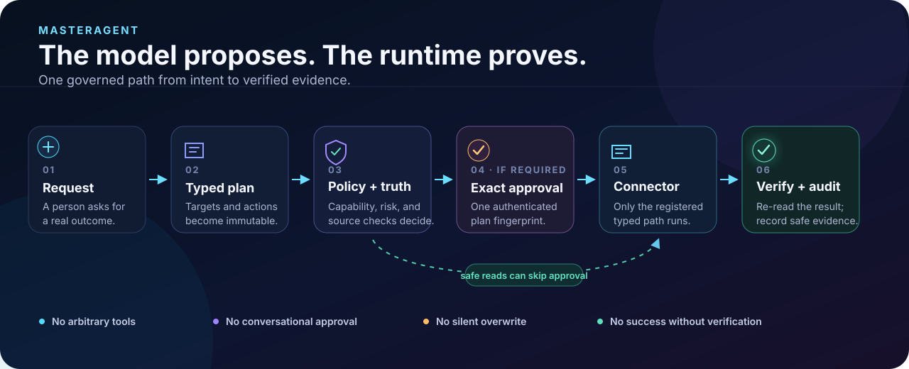

# Architecture

## Design objective

MasterAgent is a governed workflow runtime, not one omnipotent model process. The planning layer proposes typed work. Deterministic code decides whether that work is permitted, executes only registered capabilities, verifies the resulting state, and records evidence.

<p align="center">
  
</p>

For the product-level explanation and first runnable path, start with the
[project overview](../README.md) and [quickstart](quickstart.md). This document
is the maintainer-level source for components, sequence, and trust boundaries.

## Runtime flow

```text
Authenticated user
                 │
                 ▼
     user-selected MasterAgent profile
                 │
                 ▼
 direct parent handling / repository-owned advisory harness
                 │ fail closed; no direct GitHub-host child invocation
                 ▼
       parent or registered workflow
                 │
                 ▼
          Planner / plan loader
                 │
                 ▼
       Systems assessment + gate
  explicit fast path or full diagnosis
                 │
                 ▼
       immutable ChangePlan@2.0
                 │
       ┌─────────┴─────────┐
       ▼                   ▼
Capability catalog   Source-of-truth registry
       │                   │
       └─────────┬─────────┘
                 ▼
       Organization governance
                 │
                 ▼
            Policy engine
        ┌────────┼─────────┐
        ▼        ▼         ▼
     permit   approval   prohibit
        │      required
        └────────┬─────────┘
                 ▼
 Workflow orchestrator / direct-read or probe route
                 │
  dependency order / provider-data preflight
                 │
                 ▼
      capability-specific registry
                 │
   ┌─────────────┼────────────────────┐
   ▼             ▼                    ▼
read connector  draft connector  mutation/send connector
   │             │                    │
   ▼             └──────────┬─────────┘
independent verification    │
   │                        │
egress revalidation         │
and sanitization            │
   └─────────────┬──────────┘
                 ▼
       return / compensation / audit
```

### Systems-governed planning

Every executable plan carries a typed `SystemsAssessment` and the exact
`SystemsGateDecision` that admitted it. Both records are serialized inside the
immutable `ChangePlan`, so changing the outcome, constraint, intervention,
metric, failure condition, complexity evidence, or gate decision also changes
the plan fingerprint and invalidates prior approvals. The orchestrator and the
stateless direct-read preflight deserialize the plan into a private snapshot,
recompute the decision, and reject missing, denied, stale, or forged systems
evidence before audit initialization, credential resolution, connector setup,
or provider access.

The explicit fast path is limited to plans whose assessment states that the
work is low risk, reversible, and well understood, whose actions are all
`read_only` or `local_generation`, and which add no durable complexity. Other
plans require the full stocks, flows, feedback-loop, delay, unintended-effect,
metric, and stop-condition evidence. Dependencies, persistent services,
agents, configuration surfaces, authoritative documents, state stores,
connectors, and user workflows consume a weighted complexity budget. Added
complexity must include simpler alternatives, evidence that existing
mechanisms are insufficient, and an explicit removal strategy; over-budget
plans bind a review-required decision but are not admitted automatically. The
orchestrator unlocks that decision only when the configured approval authority
authenticates one current approval bound to the exact plan fingerprint and
covering every action. Missing, invalid, expired, partial, or differently bound
approvals fail before audit initialization or connector access.

Every gated assessment also carries a `StrategyKernel`: a diagnosis of the
constraint, one guiding policy, a proximate objective, explicit tradeoffs, and
bounded coherent-action intents. `StrategyActionTrace` records map every exact
plan action to one known intent, with no missing, duplicate, unknown, stale, or
unused entries. The kernel is covered by the assessment fingerprint and the
traces by the plan fingerprint.

The gated route also requires a `StrategyCoherenceReview` from a separate
trusted planning boundary. Its strict findings attest that the diagnosis
addresses the constraint, the guiding policy targets the leverage point, the
proximate objective advances the desired outcome, the action effects support
the success metric, and the tradeoffs cover relevant alternatives. The review
is bound to the exact assessment and kernel fingerprints, and its own
fingerprint is bound into the gate decision and plan. Missing, false,
type-confused, mismatched, stale, or altered review evidence fails closed.

This makes strategy reviewable without making strategy authoritative or
pretending deterministic code can prove natural-language meaning.
`EvidenceBackedSystemsAssessor` and
`EvidenceBackedStrategyCoherenceReviewer` are the concrete boundaries for
explicitly supplied evidence; they reject substituted inputs instead of
filling gaps with generated prose. Built-in workflows use the explicit
fast-path or code-owned static-intervention constructors.

Public fingerprints prove exactness, not authorship. The governed planner and
static-intervention binder therefore attach non-serialized, process-local
provenance to the exact plan they admit. Execution snapshots preserve it, while
plans reconstructed from JSON cannot claim it. Applied execution of such a
serialized gated plan requires a current authenticated approval covering the
exact plan and every action; dry runs may inspect its structure without
executing it.

After execution, `RunReport.systems_review`, `DirectReadReport.systems_review`,
and the orchestrator's terminal audit event contain content-free evidence for
metric observation, possible unintended effects, planned complexity, removal
candidates, and whether the reassessment/stop condition was independently
checked. When the runtime cannot independently observe the stated success
metric or stop condition, it records `not_observed` and requires reassessment
instead of claiming success from connector completion alone. Systems governance
is an admission layer only: capability, source-of-truth, organization
governance, policy, approval, credential, provider, execution, verification,
compensation, retention, and audit controls remain independently decisive.

An optional `EvidenceBackedSystemsOutcomeObserver` runs only after ordinary
action execution. It accepts content-free `SystemsOutcomeEvidence` bound to the
assessment, decision, and success-metric fingerprints and records observed
complexity growth and stop-condition status. Missing, malformed, mismatched, or
dry-run evidence falls back to the conservative review. The observer cannot
change admission, action states, or execution authority. See the developer
guide in [`systems-governance.md`](systems-governance.md) for the construction
and integration contracts.

Direct GitHub-host advisory invocation is disabled because that surface cannot
prove the selected-parent allowlist, depth-one routing, or per-goal counters.
The repository-owned harness is the deterministic integration-test boundary
and the control plane for the optional current Copilot SDK adapter; it is not a
second runtime or provider path. The parent continues directly whenever that
adapter is absent or cannot satisfy the full boundary.
See [`advisory-subagents.md`](advisory-subagents.md).

### Progressive user front door

The user-facing `setup`, `doctor`, and `execute` commands form a thin adapter
over the same runtime shown above. A strict organization profile supplies
reviewed configuration paths, one employee/developer mode, a private state
root, and an exact installed-capability allowlist. The profile is bound input,
not authority: the catalog, connector registry, governance, policy,
source-of-truth, credential, approval, verification, compensation, retention,
and audit boundaries remain independently decisive.

```text
setup ──> private profile + minimum local state (no provider access)
                 │
doctor ──────────┼──> install / read / draft / effect / enterprise readiness
                 │
execute PLAN ────┴──> stateless direct read
                      or bound inspect/apply/approval/resume
```

Risk determines state and interaction. Eligible single-provider direct reads
remain in memory. Draft/local and effect work use fresh descriptor-safe private
run directories. Approval-required effects emit one exact request whose resume
surface includes the original organization-profile binding. High-impact work
retains its existing mandatory controls and disabled-at-rest posture. The
low-level commands remain available and reach the same implementations.

Employee mode cannot turn a capability gap into executable code. Trusted
developer mode may expose explicit scaffolding in the development plane, but
generated effect code remains untrusted and quarantined until its independent
review, tests, specification archival, signing, deployment, and standard
runtime admission finish. Neither mode can self-approve or self-promote code.

### Platform runtime boundary

Platform-neutral package and CLI modules depend on a descriptive platform
registry instead of importing Unix-only primitives at startup. The registry
normalizes the host to one stable backend identity and reports seven independent
contracts:

- `secure_filesystem`;
- `cross_process_locking`;
- `atomic_publication_recovery`;
- `credential_storage`;
- `process_supervision`;
- `trusted_git`; and
- `capsule_isolation`.

`platform_runtime_status()` is inspection only. It returns `platform`,
`backend`, and a `capabilities` map whose entries contain `available`,
`backend`, and an optional bounded, secret-free `reason`. Help, version, and
configuration-only readiness can consume that status without initializing a
stateful backend.

Linux and macOS use the top-level `posix-linux` and `posix-macos` identities.
Both select `posix-descriptor-filesystem`, `posix-flock`,
`posix-atomic-publication`, `posix-rlimit`, and `posix-trusted-git`. Linux
selects `linux-bubblewrap` for executable capsule isolation only when a trusted
executable is available and otherwise reports that contract unavailable. macOS
reports
`capsule_isolation` unavailable because owner/group artifact trust is a secure-
filesystem property, not OS worker containment, and no native macOS isolation
backend is certified. Native Windows selects `windows-native-partial` with
`windows-handle-acl-filesystem`, `windows-lockfileex`, and
`windows-handle-atomic-state`. Its
`windows-credential-manager-current-user-dpapi` service provides exact Generic
Credential Manager entries and current-user DPAPI documents. Its
`windows-job-object` process backend launches explicit executables suspended,
assigns bounded CPU, memory, process-count, and kill-on-close limits before
resuming, inherits only selected handles and a minimal environment, and shares
one output budget across stdout and stderr. Its `windows-trusted-git` backend
pins a validated Git for Windows executable and a bounded local repository
metadata tree, rejects linked-worktree and alternate-object redirection, admits
only complete fixed read-only command forms, disables ambient configuration and
executable helpers, and launches through that Job Object boundary. Its
`windows-appcontainer` capsule backend projects an exact read-only Python
runtime into an ephemeral zero-capability profile, grants one private writable
directory, inherits only the typed protocol pipes, and applies the Job Object
quotas before resume. A non-Windows host that
explicitly inspects Windows uses
`windows-unavailable` without importing Win32 code. An unrecognized host uses
`unsupported`.

An operation selects its exact contract immediately before use. Selection
returns only the certified native implementation or raises the typed platform-
unavailable error; it never substitutes a compatibility shim, another platform,
or a weaker implementation. That failure occurs before protected state,
credentials, connector construction, provider access, or effects. Existing
POSIX implementations retain their established ownership, no-follow, locking,
atomicity, process, and Git behavior. Linux reports bubblewrap capsule
isolation only after selecting a trusted executable and otherwise fails closed;
macOS capsule execution also fails closed instead of treating account-private
artifact checks as executable isolation.

Windows therefore has a deliberately split status. Package import, command
help/version, deployment readiness, and install diagnosis are supported.
Protected read paths use a chain of retained non-delete-share Win32 handles,
fixed-volume file identity, owner SID and effective-DACL policy, and bounded
handle reads. Component and handle-path comparisons use Windows ordinal
uppercase-table semantics, preserving distinct non-linguistic Unicode names
instead of applying full case folding. Retained immutable ancestors may grant
unrelated child creation,
as normal Windows system roots do, but delete-child, metadata, generic-write,
ACL, owner, and replacement authority remain forbidden; selected targets keep
the stricter writer/private policy. Approval bindings serialize the exact
versioned Windows identity and policy digest and compare them again at
execution. The filesystem backend can also publish a new private file only
with an explicit protected DACL, bounded write/flush and readback, namespace
revalidation, and exact-created-identity cleanup. The atomic backend adds a
stable handle lock, same-parent handle-relative replacement, a protected
integrity-checked old/new ledger, destination identity/content/DACL
verification, directory flush, and deterministic restart recovery. SQLite and
the protected approval, retention, token, configuration, advisory, capsule,
plugin, and draft stores select that backend. A stateful capability remains
unavailable when another required contract reports unavailable, and its
readiness issue is `runtime_defect`. DPAPI publishes only a bounded versioned
ciphertext envelope through the same atomic backend and omits machine scope;
Credential Manager stores one bounded UTF-8 value per declared name beneath a
reviewed `MasterAgent/` namespace. Connector configuration binds the non-secret
provider and target, while values stay in the trusted in-memory credential
snapshot. The common platform and native Windows filesystem, atomic-state,
credential, process, Git, and capsule routes are released. Three-version hosted
CI and the protected x64 workflow are implemented; hosted certification remains
planned until the external clean standard-user runner produces successful
evidence.

## Repository discovery topology

Repository development uses a separate hub-and-spoke discovery map before any
broad source search:

```text
User -> MasterAgent
          -> Read Researcher (optional, read/search only)
          -> Plan Reviewer (optional, read/search only)
          -> Docs contract (applied directly by the parent)
          -> deterministic governed runtime
```

The exact ownership and topology data lives in
[`semantic-router.toml`](../.ai/semantic-router.toml). The compact
[`semantic index`](semantic-index.md) is generated from that manifest and is
navigation data, never authority. After loading the minimum repository policy,
the parent selects one route and loads only its linked policy, specification,
implementation, and verification slice. Exact inventory validation prevents a
new module, test, requirement, command, capability, connector, configuration,
profile, or platform area from silently inheriting an owner.
Configuration discovery covers every repository TOML file except specification
lifecycle metadata and ignored private, cache, or build roots, so packaged
defaults, top-level package metadata, and supply-chain inputs cannot sit outside
the exact ownership table.
Implementation, test, and current-requirement links must agree with that exact
owner. A route that intentionally references another route's shared
configuration, authority, or release gate declares that owner as an exact
dependency, so an unrelated but valid path cannot silently replace it.
Manifest reads compare the path before opening, the open descriptor, and the
path after reading. Windows uses the stable volume/file identity, size, and
modification time for that comparison because its path and descriptor APIs
project POSIX-style permission, link-count, and change-time fields differently;
replacement and content mutation still fail closed.

Generation opens the destination directory through no-follow descriptors,
writes a private same-directory temporary file, and atomically replaces the
index only after a complete synchronized write. A symbolic-link, non-regular,
or raced destination cannot redirect generated content outside the repository.

A commit-only review phrase selects the semantic-router route. The `changes`
subcommand then resolves one commit or explicit `BASE..HEAD` range through a
time- and output-bounded, read-only Git query and returns its exact changed
paths, every affected route contract, and any unmapped path. This gives the
parent a deterministic first hop without a broad preliminary repository scan.

Each specialist receives only its parent, scoped role, tool allowlist,
input/output contract, return path, and selected repository route. Specialists
do not load sibling prompts or require peer-to-peer awareness. The parent alone
knows the complete topology and independently revalidates specialist output.
The common platform-runtime and Windows filesystem, atomic-state, credential,
process, Git, and capsule routes are released. The hosted matrix and protected
x64 workflow are implemented, while hosted certification remains `planned`;
a generated index cannot present that final certification as released until
the enrolled clean standard-user runner supplies verified evidence and the
manifest advances under validation.

## Principal components

### Advisory sub-agents

The selected `MasterAgent.agent.md` profile omits the `agent` tool. Both child
profiles are non-user- and non-model-invocable and contain only `read` and
`search`. This fail-closed host configuration prevents unsupported direct or
nested child invocation.

`src/master_agent/advisory.py` loads those exact profiles for a deterministic
repository-owned boundary. A session is bound to the selected parent, depth is
fixed at one, and `src/master_agent/advisory_budget.py` atomically admits at
most three research attempts and one plan review for an authenticated goal
across independent processes. The broker rejects credential, approval, signing,
target, recipient, connector, tenant, private-context, and `ChangePlan` fields
before a worker is invoked.

The optional SDK worker binds the exact task, immutable profile, normalized
path/file inventory, HEAD, raw index entries, descriptor-read tracked bytes,
and bounded untracked file contents. The runner rehashes every commit, tree, and
prompt-bearing blob used for its manifest or profile inventory and disables Git
content conversion, replacement refs, lazy fetch, and transports. It exposes
only repository-owned route-scoped read/search tools; SDK
filesystem built-ins and ambient config, skill, and MCP discovery remain
disabled. Each specialist call has an isolated session. One client may be
reused for same-process calls in one goal and is closed at the goal boundary.
Reports remain untrusted,
cannot carry targets, approvals, plans, connectors, or secret-like content, and
become evidence only after the parent independently re-reads every citation.

If an adapter is missing or fails, the broker returns an explicit parent fallback. The deterministic policy, approval, credential, connector,
verification, compensation, retention, and audit runtime remains the only
provider-effect path.

### Domain models

`ResourceRef`, `AgentAction`, `ChangePlan`, `Approval`, `ExecutionResult`, and
`VerificationResult` are immutable dataclasses. Plans have stable SHA-256
fingerprints. The plan loader rejects an oversized file before JSON parsing,
then applies iterative depth, fan-out, node, string, action, dependency, and
aggregate parameter budgets before recursive model construction. Dependencies
are validated for missing references and cycles.

### Capability catalog

`config/capabilities.toml` defines the public execution surface. Each dotted capability declares:

- enabled state;
- authentication class;
- risk tier;
- reversibility;
- exact target system and allowed resource types;
- a top-level parameter schema for every enabled side effect;
- explicit input and output byte quotas for every local-generation capability;
- an exact versioned result schema, content-bearing resource descriptors, and
  fixed envelope metadata for every read-only capability;
- required effective OAuth scopes, expected-version requirements, and the
  provider precondition that makes a modifying write atomic;
- whether the capability uses an external model;
- optional description.

A connector may not expose an uncatalogued capability in the standard runtime.
The orchestrator rechecks the resolved connector's approval-bound principal,
authentication mode, granted scopes, and compensation interface before any
effect. High-impact merge is represented but disabled, making prohibition
explicit rather than relying on an absent endpoint.

### Capability capsule promotion

Generated capability source remains quarantined data. A capsule packages its
typed contract, immutable source/artifact identity, dependency lock, CycloneDX
SBOM, licenses/notices, tests, verification and compensation contracts,
destinations, credential requirements, resource limits, and provenance. Six
separate roles sign the ordered lifecycle from quarantine through validation,
review, publication, and enablement; deprecation and revocation append new
terminal states.

A foreign custom-agent capability enters through an earlier descriptive gate.
The versioned self-contained export is captured as immutable bytes and parsed
without loading or running its embedded source. Inspection classifies
references, compatible pure capsules, catalog conflicts, unsupported surfaces,
and unsafe authority or executable requirements. Selecting one compatible
ability requires its exact previewed source digest and derives a capsule policy
identity that binds that digest and the declared publisher. The result is only
an installed signed quarantine; it does not create a catalog definition or
routing card.

The installed CLI composes the complete supported operator lifecycle. It can
promote an exact quarantine using distinct environment-backed role authorities,
authenticate state, policy-filter an explicit set of enabled versions for
intent routing, and execute the chosen pure capability only after binding it
into a normal typed plan. Disable and revoke append terminal manifests; a new
version repeats preview and promotion without overwriting prior evidence.

The current worker admits only dependency-free pure read/local-generation
capsules. It executes their AST-restricted program in Linux bubblewrap or a
native Windows zero-capability AppContainer with no network, no ambient
environment, a read-only runtime, an ephemeral work directory, and
process/CPU/memory/time/input/output quotas. Complete signed
manifest and artifact verification occurs before a connector is constructed.
Provider destinations, credentials, or declared effects cause activation to
fail closed because a production provider-capsule adapter is not bundled.

An enabled capsule contributes one normal `CapabilityDefinition` and one typed
connector. Its version, all security-relevant digests, publisher/reviewer,
principal/account, classification/retention, destinations, scopes, and quotas
are stored in `ExecutionContext`, and therefore in the plan and approval
fingerprint. Policy filters compact capability cards before advisory intent
matching. A time/call/byte-bounded active session then admits only those exact
selected identities. See
[`capability-capsules.md`](capability-capsules.md).

### Organization governance

`organization-profile.toml` is the user-workflow selector: it points at the
reviewed configuration set and narrows the installed capabilities exposed to
that employee or trusted developer. It does not replace the governance file or
make a listed capability permissible.

`config/governance.toml` maps capability patterns to:

- accountable owner;
- authentication expectation;
- allowed data classifications;
- allowed environments;
- approval tier;
- enabled state.

The most specific matching rule wins. Uncovered capabilities fail closed. Dual approval requires two distinct approvers.

The same governance file owns `[model_context]`, which selects the active
provider-data destination and model tenancy and matches classification-aware
handling rules independently of whether a capability itself invokes a model.

### Policy engine

`config/policy.toml` provides hard runtime rules:

- read/local generation may be automatic;
- reversible writes, external communication, and high impact require approval;
- destructive actions are prohibited;
- retrieved content cannot authorize writes;
- merge, deletion, generic permission changes, invitations, protected-branch
  operations, and GitHub administration without provider compare-and-swap are
  denied.

### Provider-data model-context boundary

`provider_egress.py` owns the cross-cutting return boundary for direct reads,
applied reads, provider probes, and repository-list shortcuts. A no-I/O
preflight selects one unambiguous rule and validates fields, collection limit,
route, audit, and DLP availability before principal attestation or connector
content access. The immutable binding then incorporates connector
configuration/origin/account digests, action and request fingerprints, the
exact requested projection or catalog result contract, size limits,
classification, destination, tenancy, and handling. Attestation and content
access reuse one captured credential snapshot; the exact endpoint, origin, and
CA identity are checked before provider access and again before return.

After independent connector verification, the runtime recomputes that binding
and returns only a private schema-projected, recursively redacted, reference-
minimized, byte-limited copy. One separator-insensitive identity covers nested
reserved, secret, configured-redaction, reference, and prompt-finding keys.
Applied audit records contain binding facts,
digests, counts, and outcomes only. An ephemeral route creates no provider-data
state.

### Source-of-truth registry

Canonical resources are validated before execution. Identity includes the
exact system, resource type, resource ID, governed field, and reviewed
parameter selector. A governed projection,
including a matching local-generation target, cannot be updated without an
authorized canonical change in the same plan when the registry says the field
is outbound-only. Each allowed capability has a reviewed scalar parameter
selector; the registry hashes the actual immutable canonical and projection
values and requires an exact match through the dependency graph. Caller-supplied binding
digests do not grant authority, and missing capability verifiers fail during
configuration loading. Composite outputs without a typed field-addressed schema
are denied for exact governed targets.

### Connector registry

Connectors register a system name and explicit capability set. Multiple connectors may serve one system only when their capability sets do not overlap. This allows, for example, live Outlook reads and local Outlook draft generation to coexist safely.

Authentication is selected by the typed capability contract, not by a blanket
provider default. The runtime uses the least-authorized registered route that
can return the requested data. A capability classified for anonymous public
access constructs an authentication-free connector and does not consult
credential resolution, even when an ambient provider credential exists.
Authenticated routes are reserved for private, account-visible, or otherwise
identity-bound data.

Raw plugin connectors are discovered, locked, and bound to plans without import.
Before hashing, the complete bounded distribution inventory must pass strict
relative-path validation. Every artifact is then opened without following
links beneath one descriptor-pinned, owner-checked distribution root; type,
owner, identity, per-file size, and aggregate size are verified. They are not
loaded during apply. The capsule worker does not change that raw entry-point
boundary: it accepts only a separately reviewed, dependency-free pure capsule.
A plugin with dependencies still needs a sealed complete dependency filesystem
before it can become executable.

### Ephemeral direct read sessions

`run --direct-read` is a separate execution type for a direct-user plan made of
read-only actions against exactly one built-in typed provider. It performs the
same catalog, governance, policy, source-of-truth, credential, connector
identity/scope, endpoint, response-budget, prompt-injection, and independent
re-read validation required for typed reads. It additionally authorizes an
ephemeral provider-data binding before access, recomputes it after verification,
and returns only the exact-schema sanitized copy plus content-free metadata. It
holds its binding and report in memory and does not construct the applied
runtime's audit, idempotency, artifact, approval, result-publication, plugin, or
capsule state.

The direct executor validates the whole plan before provider setup, uses a
`ReadOnlyConnector` only, and shares one HTTP budget across each read and its
verification. It rejects workflow or persisted execution context, multiple
providers, effects, non-direct authority, and approval-required actions. This
route also requires an immutable explicit fast-path systems binding before any
provider setup. Its returned in-memory report includes the same conservative,
content-free systems review as the applied runtime. This keeps the convenient
path structurally unable to become an effect bypass; the orchestrator below
remains the only execution owner for provider effects.

### Orchestrator

The orchestrator:

1. validates capability and source-of-truth rules;
2. evaluates approvals;
3. resolves dependencies;
4. preauthorizes provider-read egress on the audited route before dispatch;
5. atomically claims side effects by action fingerprint and records explicit
   pending, completed, failed, or indeterminate outcomes;
6. executes one typed connector capability;
7. immediately records `side_effect_may_have_occurred` with content-free result
   metadata before invoking verification;
8. preserves the exact returned result and records an `indeterminate` incident
   if verification fails or raises;
9. for a verified read, recomputes its binding, sanitizes the private result,
   and records only content-free egress metadata;
10. records the final action state;
11. compensates reversible actions in reverse order only when the typed
   descriptor permits automatic execution and the adapter can enforce an
   atomic post-state precondition.

There is no claim of an atomic transaction across external systems. Partial results are explicit.

A certified pre-effect failure is durable but can be atomically claimed by a
later explicit retry. An indeterminate effect remains blocked. It can become a
reused completion only when a connector stored bounded content-free provider
metadata and independently re-reads the exact provider resource successfully;
otherwise operator reconciliation is required.

`ExecutionResult.compensation` is a `CompensationDescriptor`, not an arbitrary
mapping. Its persisted form is `master-agent/compensation@1`; unversioned
legacy rollback metadata is rejected. Mode `plan` supports reconstruction as a
new approval-bound plan, `in_process` is limited to the originating verified
connector flow, and `manual` prevents the orchestrator from invoking rollback.

When policy returns `approval_required`, the CLI publishes a mode-`0600`,
create-only request inside the already pinned artifact root. The request copies
the exact pending action manifests and captures the complete non-secret run
selection. It is not an authorization input. `approve-request` checks the
request fingerprint, referenced plan, and bound authority digest before
issuing the existing authenticated exact-plan approval; `resume-approval`
replays the captured arguments through the normal execution-context gates.
This closes the usability gap without letting chat text, an edited request, or
the agent create authority.

All other CLI JSON output uses that same restricted publication boundary:
pin and validate the preexisting parent, create the final name exclusively as
mode `0600` without following symlinks, verify its descriptor identity, write
and read back the exact serialized bytes, and fsync the file and directory.
Publication never creates a security-boundary directory or replaces an
existing name.

Structured artifacts preserve reviewed raw content only inside those explicit
restricted outputs. Terminal diagnostics use a separate centralized renderer:
ordinary Unicode remains readable, while terminal controls and bidirectional
formatting controls become visible `\uXXXX` text and each dynamic field has a
hard rendered-length ceiling. A retrieved excerpt therefore cannot erase or
reorder its diagnostic prefix.

Local draft connectors share one bounded artifact budget for the complete run.
They check each capability's declared bundle quota and the shared budget before
creating any final name. Artifact readback and later verification hash bounded
chunks instead of retaining a second whole-artifact buffer.

### Audit

The SQLite audit log is tamper-evident through a hash chain. Provider-read audit
events contain egress bindings, fingerprints, digests, counts, and outcomes but
exclude provider bodies, query values, raw account identities, injection
excerpts, and secrets. Other full evidence is written only through an explicit
output/retention path.

Capsule runs add an atomic content-free checkpoint state machine and a signed
terminal receipt. Resume requires the exact plan and capsule-binding digest;
normal action idempotency controls decide whether connector work may continue.
Receipts bind policy/approval identity, capsule digests, action/readback and
compensation digests, and the audit-chain anchor. Production requires an
external healthy tamper-resistant receipt sink; local SQLite cannot satisfy
that gate.

### Persistent work memory

`WorkMemory` is an optional local terminal journal beside, not inside, the
governed execution path. It accepts only explicit bounded work metadata and an
explicit database path; it performs no provider, network, hook, scheduler, or
server action. Each native pinned SQLite transaction verifies the existing
global event chain and durable count/head checkpoint before appending one
canonical event. Current stage is replay-derived, so there is no separate
mutable status row that can disagree with history.

`show` and `verify` open an existing read-only pinned snapshot. Exact schema,
row, hash, sequence, event-kind, work-start, lifecycle, terminal-merge, and
checkpoint validation rejects corrupt or substituted logical history without
creating or repairing it. Lifecycle stages remain strictly local progress
labels. Summaries and references are untrusted metadata and have no path into
identity, capability, policy, approval, or execution authority.

### Retention and citations

Normalized resources receive stable citation IDs. Metadata-only persistence is
projected through fixed nested schemas, with opaque identifiers and provider
messages represented by stable digests/reason codes. Prohibited retention
matches override every allow rule. Retained evidence and its sidecar are
fsynced through mode-`0600` same-directory staging files and create-only
published manifest-first. Descriptor-relative repair can move orphaned
identities into a private same-filesystem quarantine.

Expiration preview and explicit POSIX deletion share one deterministic,
bounded descriptor-relative validation plan beneath a pinned root. The runtime
first exposes and exclusively holds the exact selected-parent retention lock
for publication. It then shared-locks every existing retention boundary in the
owner-controlled pinned ancestor chain. Maintenance uses the same handshake:
an exclusive selected-root lock, shared existing ancestor retention locks, and
every discovered evidence-parent lock. Thus it still holds the root retention
lock plus every discovered evidence-parent lock. A parent operation either owns
an ancestor lock before a child starts or discovers the child's already-visible
leaf lock during its bounded scan. It rescans the exact descriptor tree and
rejects identity, mode, link, manifest, digest, sibling, size, limit, or
concurrency drift before starting new deletion. Each expired evidence/sidecar
pair is hard-linked into a private, bounded, same-filesystem, content-free transaction before either public name
is removed. The common source parent is fsynced with both public names absent
before recovery links are discarded, allowing a later apply to complete or
roll back interrupted staging without losing deletion durability. Pending
transactions beneath a nested retention root make an ancestor scan fail closed
until the exact child root is recovered. Native Windows uses retained handles
and the same tree-wide cooperative lock, then records an exact content-free
pair-removal or quarantine intent before the first irreversible step. A later
apply accepts only the recorded source identities and completes the all-absent
or destination-present/source-absent state; preview reports pending recovery
without mutating it.

Descriptor-relative orphan repair participates in the same selected-root,
ancestor, and descendant-parent lock handshake. It repeats the bounded scan
while those locks are held before classification or quarantine, so ancestor
repair cannot move a manifest from an active child-first publication.

### Recurring runner

Recurring workflows use a versioned `master-agent/recurring-occurrence@1`
artifact for exactly one immutable plan and canonical scheduled instant. A
schedule determines eligibility only; it grants no capability, target,
recipient, credential, or approval.

The local binder exclusively publishes beneath a pre-existing private pinned
root and atomically registers the exact artifact digest in a separately trusted
SQLite claim store. A self-contained digest is never authentication. The
occurrence binds:

- a built-in workflow kind;
- registration generation and referenced-config digests;
- canonical UTC instant, IANA timezone, offset, fold, tzdata digest, maximum
  lateness, latest-only catch-up, and approval-resume deadline;
- delivery mode;
- exact capability, recipient, canonical-source, action, target, plan, runtime,
  provider-principal/scope, plugin/capsule, and filesystem identities;
- a strict typed non-secret `ApprovalRunInvocation`; and
- one occurrence execution key that namespaces every provider write/send and
  every create-only local output name while reads remain fresh.

Apply performs pre-secret authentication and structural validation, atomically
reserves the occurrence, then lets the existing applied-run path select secrets
and attest principals/scopes. A monotonically increasing generation plus random
claim token is rechecked immediately before every provider effect. Approval
waits release the lease into an occurrence-bound `approval_blocked` state; an
exact approval request resumes the same occurrence with a new generation.

Expired attempts reconcile from occurrence-keyed audit/idempotency state. Only
certified pre-effect or independently reusable completed effects become
recoverable; pending, conflicting, or indeterminate effects remain blocked.
The claim store guarantees one active fenced attempt on one supported host, not
distributed transactions or exactly-once provider effects. Legacy direct
`weekly-status`, `communication-context`, and workflow-name recurring execution
remain fail closed.

## Trust boundary

Authority order, highest to lowest:

1. platform security policy;
2. organization governance;
3. master-agent constitution;
4. registered workflow definition;
5. direct authenticated user instruction;
6. retrieved internal content;
7. retrieved external content.

Lower-trust content cannot grant permissions, introduce credentials, change recipients, add capabilities, alter approvals, or redefine canonical sources.

## Process boundaries

For a production deployment, separate these operational identities where possible:

- read-only connector identity;
- reversible-write identity;
- communication identity;
- scheduler identity;
- audit sink writer;
- capsule promotion authorities and isolated worker identity;
- production credential broker and external receipt sink;
- human approvers.

Do not give the planning model raw provider credentials. The deterministic runtime resolves secret references immediately before constructing an approved connector.
